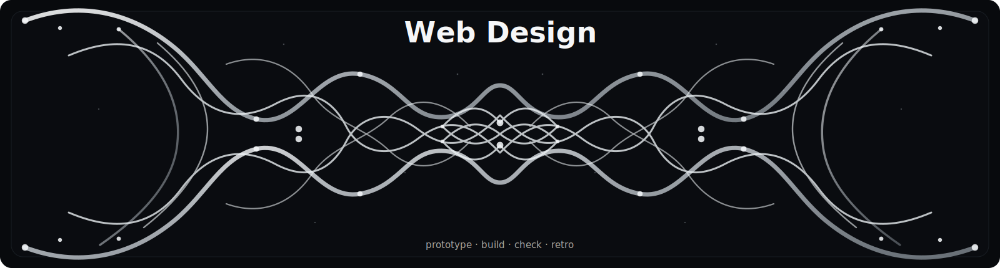

<div align="center">
  

  <h3>A Codex Web Design skill suite for prototype, design, build, check, and retro</h3>

  <p><strong>one stage, one artifact</strong> · design-gated development · Figma-to-web build path</p>

  <p>
    
    
    
    
    
  </p>

  <p>
    <a href="docs/philosophy.md">Philosophy</a> ·
    <a href="docs/workflow.md">Workflow</a> ·
    <a href="docs/output-contracts.md">Output Contracts</a> ·
    <a href="examples/landing-page.md">Examples</a>
  </p>
</div>

---

## What This Is

Web Design is a Codex skill workflow for taking a web product from rough intent to prototype, from prototype to development-ready design handoff, from design or prototype to working code, from code to acceptance checks, and from repeated lessons to better skills.

The current operating loop is:

```text
prototype
  -> web-design
  -> build or figma-web-build
  -> check
  -> retro
```

For Figma or screenshot-driven implementation, `figma-web-build` coordinates a dedicated development chain that analyzes the design, maps it to the repository, implements code, fills interaction states, aligns browser rendering, verifies in real viewports, and finishes with quality checks.

This is not a design-template pack. It is a compact operating system for senior designers, design founders, and product builders who want fewer handoff documents and more usable artifacts.

## Core Rule

One stage, one artifact.

Each skill may use product thinking, design critique, repo analysis, QA methods, browser evidence, and retrospection internally. The external output must still match the stage contract.

| Stage | Primary skill | Required artifact |
|---|---|---|
| Requirements | `prototype` | Runnable, reviewable interactive prototype |
| Design | `web-design` | Handoff guidance, `Design Handoff Submission`, or build entry notes |
| Design review | `web-design-handoff-review` | `Design Handoff Checklist` |
| Development | `build` | Working code |
| Figma development | `figma-web-build` | Working code plus concise browser evidence |
| Testing | `check` | `Adjustment Checklist` |
| Retrospective | `retro` | `Skill Upgrade Guide` |

## Main Skills

### `prototype`

Turn a product idea, PRD, feature request, user story, customer feedback, workflow, or vague web-app brief into the requirements-stage artifact: a runnable interactive prototype.

### `web-design`

Prepare and gate the design stage between product intent and code. Use it to organize designer submission requirements, decide whether a design needs `web-design-handoff-review`, and produce build entry notes when the design is ready or conditionally ready.

### `web-design-handoff-review`

Review Figma frames, screenshots, design submissions, prototype context, breakpoints, states, content, assets, tokens, and interactions for build readiness. Output only a `Design Handoff Checklist` with `Ready for build: Yes`, `Conditional`, or `No`.

### `build`

Implement or update web app code. Use it after an approved prototype, after `check` returns an adjustment checklist, or when ordinary product intent needs to become code without a Figma-specific path.

### `figma-web-build`

Coordinate implementation from Figma frames, screenshots, design images, or visual QA evidence. Use it when the source of truth is a design artifact and the page needs browser-level visual and responsive fidelity.

### `check`

Inspect implemented code or a running app against the prototype, design baseline, or accepted intent. Output only an actionable `Adjustment Checklist` for the next development pass.

### `retro`

Turn project evidence, failed handoffs, repeated rework, visual QA misses, or user corrections into a Codex-ready `Skill Upgrade Guide`.

## Figma-To-Web Chain

`figma-web-build` can run a light, standard, or strict path. The standard path is:

| Order | Skill | Role |
|---|---|---|
| 1 | `figma-web-design-analysis` | Convert Figma frames, screenshots, or images into implementable structure, tokens, states, assets, and unknowns |
| 2 | `figma-web-repo-analysis` | Inspect framework, package manager, routes, components, styling, assets, commands, and constraints |
| 3 | `figma-web-implementation-map` | Map design objects to route, component, token, asset, responsive, and implementation strategy |
| 4 | `figma-web-code-implementation` | Write or update routes, layouts, components, styles, content, data wiring, and assets |
| 5 | `figma-web-interaction-states` | Add hover, focus, active, disabled, loading, empty, error, modal, tab, carousel, form, and motion states |
| 6 | `figma-web-visual-alignment` | Tune browser-rendered spacing, typography, media crop, alignment, overflow, and responsive layout |
| 7 | `figma-web-browser-verification` | Start or reuse a dev server, capture screenshots, inspect console/runtime/DOM, and verify interactions |
| 8 | `figma-web-quality-finish` | Run lint, typecheck, build, tests, accessibility basics, performance checks, cleanup, and final reporting |

## Supporting Skills

| Skill | Use when |
|---|---|
| `prd-to-reviewable-prototype` | A rough PRD needs a shareable low-fidelity review prototype |
| `responsive-page-adapter` | The task is primarily mobile/tablet adaptation, breakpoint repair, overflow, overlap, or responsive regression |
| `frontend-visual-qa-coach` | A rendered page needs second-pass visual QA, screenshot-based findings, repair prompts, and reusable development-skill upgrades |
| `task-retro-upgrader` | A completed task should become a scoped skill-maintenance brief instead of immediately editing a skill |

## Choosing The First Skill

| Situation | Start with |
|---|---|
| Only a product idea exists | `prototype` |
| A rough PRD needs a reviewable prototype | `prd-to-reviewable-prototype` |
| A designer needs handoff requirements | `web-design` |
| A design needs build-readiness review | `web-design-handoff-review` |
| A Figma frame or screenshot should become a page | `figma-web-build` |
| An approved prototype should become code | `build` |
| `check` found implementation issues | `build` |
| The problem is mostly responsive adaptation | `responsive-page-adapter` |
| A rendered page needs independent acceptance | `check` |
| A completed loop should improve the skills | `retro` or `task-retro-upgrader` |

## Recommended End-To-End Paths

New page with design handoff:

```text
prototype
  -> web-design
  -> web-design-handoff-review
  -> figma-web-build
  -> check
  -> build
  -> check
  -> retro
```

No Figma, only product intent:

```text
prototype
  -> web-design
  -> build
  -> check
  -> retro
```

Existing Figma ready for implementation:

```text
web-design-handoff-review
  -> figma-web-build
  -> check
  -> build
  -> check
  -> retro
```

Existing page with visual or responsive issues:

```text
frontend-visual-qa-coach
  -> build or responsive-page-adapter
  -> check
```

## Repository Map

```text
skills/
  prototype/                         Requirements -> interactive prototype
  web-design/                        Design-stage handoff preparation and build gate
  web-design-handoff-review/         Design handoff checklist
  build/                             Development -> working code
  figma-web-build/                   Figma-to-web orchestration
  figma-web-*/                       Figma design analysis, repo scan, mapping, code, states, alignment, browser verification, finish
  check/                             Testing -> adjustment checklist
  retro/                             Retrospective -> skill upgrade guide
  prd-to-reviewable-prototype/       Rough PRD -> reviewable low-fidelity prototype
  responsive-page-adapter/           Responsive repair and validation
  frontend-visual-qa-coach/          Visual QA coach and repair prompt generator
  task-retro-upgrader/               Scoped skill-maintenance brief

docs/
  philosophy.md
  workflow.md
  output-contracts.md

examples/
  landing-page.md
  saas-app.md
  workflow-tool.md
  qa-checklist.md
```

## Read More

- [Philosophy](docs/philosophy.md)
- [Workflow](docs/workflow.md)
- [Output Contracts](docs/output-contracts.md)
- [Landing Page Example](examples/landing-page.md)
- [SaaS App Example](examples/saas-app.md)
- [Workflow Tool Example](examples/workflow-tool.md)
- [QA Checklist Example](examples/qa-checklist.md)
